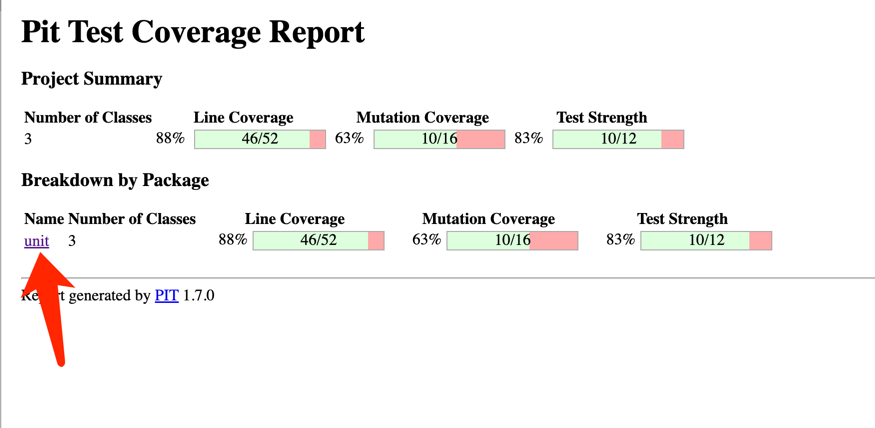
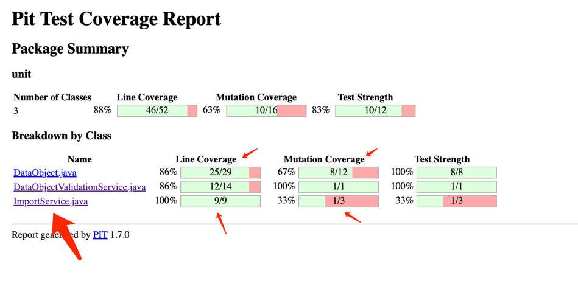
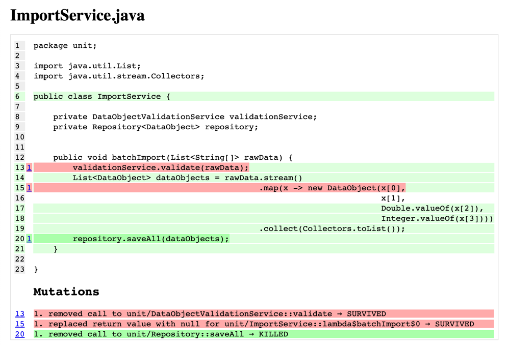

# mutation-test-java-demo

## 目标
1. 学习使用 Pitest 得到变异测试覆盖率
2. 学习如何消除存活的变异

## 使用
### 查看变异测试报告
1. 执行命令 `git checkout mutation-coverage-33%` 切换到 tag mutation-coverage-33%
2. 查看 `src/main/java/unit/ImportService.java`，记住函数 `batchImport` 的逻辑
3. 查看 `src/test/java/unit/ImportServiceTest.java`，此时只有一个用例。思考这个用例有什么问题
4. 命令行运行 `./gradlew clean pitest`
5. 浏览器打开文件 `build/reports/pitest/index.html`，可查看 pitest 报告如下图

### 查看 ImportService 覆盖率情况
1. 点击上图箭头，可见报告如下图，其中 ImportService.java 的 `行测试覆盖率（Line Coverage）` 是 100%，`变异覆盖率（Mutation Coverage）`是33%

### 查看 ImportService 变异存活情况
1. 点击 `ImportService` 查看类变异存活情况，可见报告如下图，共有3个变异，其中两个存活（红色），一个被杀死（绿色）

## 思考如何消除变异

### 消除变异
#### 消除一个变异
1. 执行命令 `git checkout mutation-coverage-67%` 切换到 tag mutation-coverage-67%， 运行 `./gradlew clean pitest`
2. 再次查看 ImportService 变异存活情况，可见一个变异被杀死
3. 打开 `src/test/java/unit/ImportServiceTest.java`，查看新的测试用例是如何消除变异的

#### 消除另一个变异
1. 执行命令 `git checkout mutation-coverage-100%` 切换到 tag mutation-coverage-100%， 运行 `./gradlew clean pitest`
2. 再次查看 ImportService 变异存活情况，可见三个变异全都被杀死
3. 打开 `src/test/java/unit/ImportServiceTest.java`，查看新的测试用例是如何消除变异的

## 思考题
1. [ ] 为什么需要关注变异测试
2. [ ] 变异测试对编写单元测试有何帮助
3. [ ] 如何协调单元测试覆盖率和变异测试覆盖率

